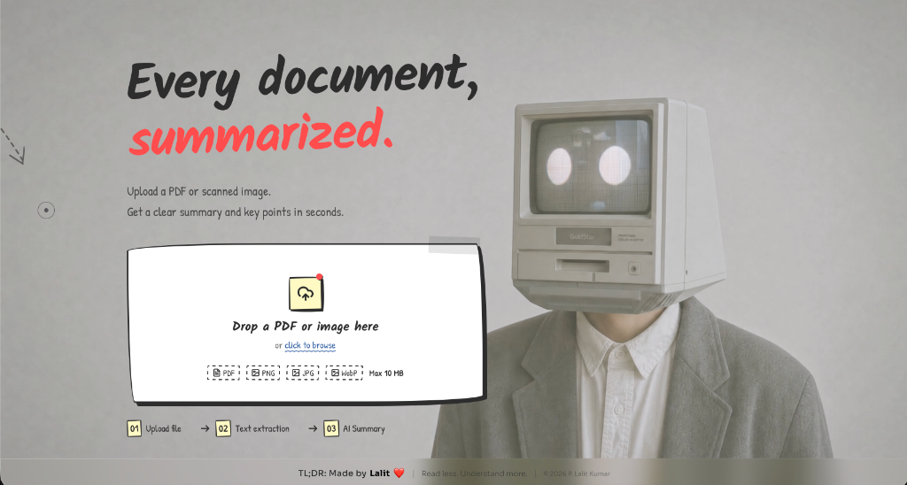
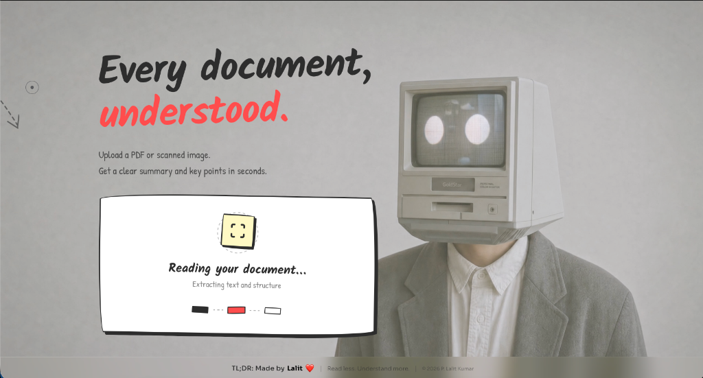
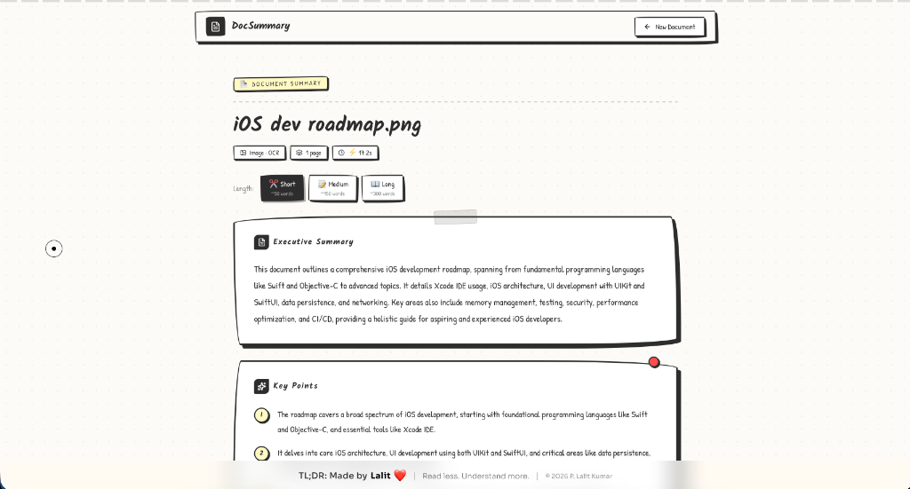
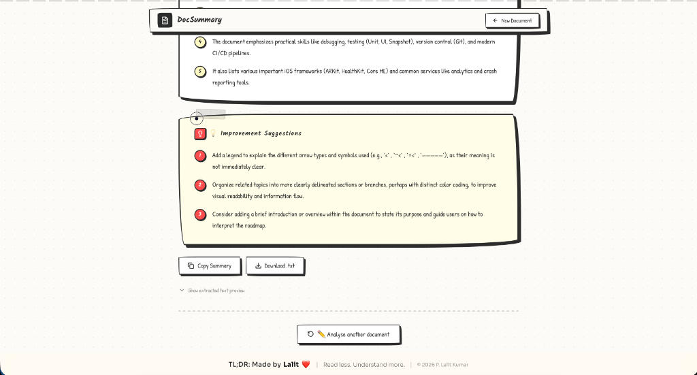

<div align="center">

# TL;DR — Document Summary Assistant

### *Read less. Understand more.*

[](https://doc-summary-unthinkable.vercel.app)
[](https://nextjs.org/)
[](https://aistudio.google.com/)
[](https://vercel.com)
[](https://www.typescriptlang.org/)

> Upload any PDF, scanned image, or text file — get a **structured AI summary**, **key insights**, and **improvement suggestions** in seconds.

</div>

---

## 📸 Screenshots

<table>
  <tr>
    <td align="center" width="50%">
      
      <br/>
      <sub><b>① Upload Screen</b> — Drag-and-drop with live file type validation</sub>
    </td>
    <td align="center" width="50%">
      
      <br/>
      <sub><b>② Processing</b> — Real-time OCR extraction with progress indicator</sub>
    </td>
  </tr>
  <tr>
    <td align="center" width="50%">
      
      <br/>
      <sub><b>③ Results View</b> — Executive Summary + Key Points with toggleable lengths</sub>
    </td>
    <td align="center" width="50%">
      
      <br/>
      <sub><b>④ Insights & Actions</b> — Improvement suggestions + Copy/Download export</sub>
    </td>
  </tr>
</table>

---

## 🎯 What This Project Demonstrates

This was built as a **full-stack AI product** within an 8-hour budget — showcasing end-to-end engineering from file ingestion to structured LLM output and a polished production UI.

| Skill Area | Demonstrated By |
|---|---|
| **AI / LLM Integration** | Gemini 1.5 Flash with structured JSON output via Zod schema validation |
| **Full-Stack Architecture** | Next.js App Router with serverless API routes |
| **Computer Vision / OCR** | Tesseract.js pipeline for scanned docs and image-only PDFs |
| **Resilient Data Pipeline** | Map-reduce chunking for long documents exceeding context limits |
| **UI/UX Engineering** | Framer Motion animations, Spline 3D backgrounds, Glassmorphism design |
| **Type Safety** | TypeScript strict mode throughout, Zod runtime validation |
| **Testing** | Vitest unit tests covering extraction and summarization logic |
| **Deployment** | Zero-config Vercel deploy with environment-secured API keys |

---

## ✨ Features

- **📤 Smart File Upload** — Drag-and-drop or file picker. Supports PDF, PNG, JPG, WebP up to 10 MB with instant validation.
- **🔍 Dual-Mode Text Extraction** — Native PDF text layer parsed directly via `unpdf`; images and scanned PDFs routed through Tesseract.js OCR automatically.
- **🤖 AI-Powered Summarization** — Gemini 1.5 Flash generates a structured `{ summary, keyPoints[], improvementSuggestions[] }` JSON response.
- **📏 Adjustable Summary Length** — Toggle between **Short (~50 words)**, **Medium (~150 words)**, and **Long (~300 words)** on the fly — no re-upload needed.
- **🎯 Key Points Extraction** — 3–5 structured, numbered insights extracted independently from the summary.
- **💡 Improvement Suggestions** — LLM-generated, document-aware suggestions for how the *source* document could be improved.
- **📋 Copy & Export** — One-click copy to clipboard and download-as-`.txt` for any summary.
- **🌀 Progressive Loading States** — Distinct animated states for upload → extraction → summarization with descriptive labels.
- **⚠️ Graceful Error Handling** — Typed error codes (`UNSUPPORTED_FILE_TYPE`, `FILE_TOO_LARGE`, `EXTRACTION_FAILED`, `SUMMARIZATION_FAILED`) with user-friendly UI messages.
- **📱 Fully Responsive** — Works seamlessly on desktop and mobile.

---

## 🏗️ Architecture & How It Works

```
┌─────────────┐     multipart/form-data     ┌────────────────────────────┐
│  Next.js    │ ──────────────────────────► │  POST /api/process         │
│  Client     │                             │                            │
│  (React 19) │ ◄────────────────────────── │  1. Validate file & size   │
└─────────────┘     JSON response           │  2. Extract text:          │
                                            │     • PDF  → unpdf         │
                                            │     • IMG  → Tesseract OCR │
                                            │  3. Chunk if > token limit │
                                            │  4. Gemini 1.5 Flash       │
                                            │     (structured output)    │
                                            │  5. Zod schema validation  │
                                            │  6. Return typed JSON      │
                                            └────────────────────────────┘
```

**Key design decisions:**

1. **Unified pipeline** — A single `/api/process` endpoint detects file type and routes to the appropriate extractor. The client never needs to know whether OCR ran.
2. **Map-reduce for long docs** — Documents exceeding the model's context window are split into chunks, each summarized independently, then merged — preventing truncation on large PDFs.
3. **Zod schema on LLM output** — The AI response is validated against a strict Zod schema before being returned to the client, preventing malformed data from reaching the UI.
4. **Stateless server** — No database, no sessions. Each request is self-contained, making the app trivially scalable on serverless infrastructure.

---

## 🛠️ Tech Stack

| Layer | Technology | Rationale |
|---|---|---|
| **Framework** | [Next.js 16](https://nextjs.org/) (App Router) | Unified frontend + serverless API, zero-config Vercel deploy |
| **Language** | TypeScript (strict) | End-to-end type safety, better DX |
| **AI / LLM** | [Gemini 1.5 Flash](https://aistudio.google.com/) via AI SDK | Best quality/latency for summarization; native structured output |
| **PDF Parsing** | `unpdf` | Reliable native PDF text layer extraction |
| **OCR** | `tesseract.js` | Client/server OCR with no external API dependency |
| **Styling** | [Tailwind CSS v4](https://tailwindcss.com/) + Framer Motion | Rapid prototyping + smooth animations |
| **3D UI** | `@splinetool/react-spline` | Interactive 3D background for premium feel |
| **Validation** | [Zod v4](https://zod.dev/) | Runtime schema validation on LLM output |
| **Testing** | [Vitest](https://vitest.dev/) | Fast, Jest-compatible unit testing |
| **Hosting** | [Vercel](https://vercel.com) | Serverless-native, global CDN, instant previews |

---

## 🚀 Getting Started

### Prerequisites
- **Node.js 18+**
- A **[Google AI Studio](https://aistudio.google.com/)** API key (free tier works)

### Installation

```bash
# 1. Clone the repository
git clone https://github.com/lalitcodekr/document-summary-assistant.git
cd document-summary-assistant

# 2. Install dependencies
npm install

# 3. Set up environment variables
cp .env.local.example .env.local
```

Edit `.env.local` and add your Gemini API key:

```env
GEMINI_API_KEY=your_api_key_here
```

### Run Locally

```bash
npm run dev
```

Open [http://localhost:3000](http://localhost:3000) — you should see the upload screen.

### Run Tests

```bash
npm test
```

---

## 📦 Deployment

Deploys in one click to [Vercel](https://vercel.com):

1. Push to GitHub.
2. Import the repo in the Vercel dashboard.
3. Add `GEMINI_API_KEY` under **Settings → Environment Variables**.
4. Hit **Deploy**. 🚀

**Live instance:** [doc-summary-unthinkable.vercel.app](https://doc-summary-unthinkable.vercel.app)

---

## 📚 API Reference

### `POST /api/process`

**Request:** `multipart/form-data`

| Field | Type | Description |
|---|---|---|
| `file` | `binary` | PDF, PNG, JPG, or WebP — max 10 MB |
| `summaryLength` | `"short" \| "medium" \| "long"` | Desired output length |

**Response `200`:**

```json
{
  "extractedTextPreview": "First 500 chars of extracted text...",
  "summary": "Executive summary string...",
  "keyPoints": ["Point 1", "Point 2", "Point 3"],
  "improvementSuggestions": ["Suggestion 1", "Suggestion 2"],
  "meta": {
    "sourceType": "pdf | image",
    "pages": 5,
    "processingTimeMs": 3240
  }
}
```

**Error Response:**

```json
{
  "error": {
    "code": "UNSUPPORTED_FILE_TYPE | FILE_TOO_LARGE | EXTRACTION_FAILED | SUMMARIZATION_FAILED | TIMEOUT",
    "message": "Human-readable description"
  }
}
```

---

## ⚠️ Known Limitations

| Limitation | Notes |
|---|---|
| **English-only** | OCR and summarization are optimized for English in v1 |
| **Single document** | No batch or multi-document comparison yet |
| **No persistence** | Results are session-only — no accounts or history |
| **OCR accuracy** | Depends on scan quality; raw text preview is shown for transparency |
| **API rate limits** | Free-tier Gemini keys may throttle on the live demo under heavy load |

---

## 🔭 Roadmap

- [ ] Multi-language OCR and summarization
- [ ] Batch / multi-document upload with side-by-side comparison
- [ ] User accounts with saved summary history
- [ ] Export to PDF / Word / Notion
- [ ] Chat with document (RAG / Q&A mode)
- [ ] Browser extension for summarizing web articles

---

## 👨‍💻 About

Built by **[Lalit Kumar](https://github.com/lalitcodekr)** as a technical assessment project.

*Built with ❤️ — Read less. Understand more.*

---

<div align="center">
  <sub>© 2026 Lalit Kumar &nbsp;·&nbsp; TL;DR Document Summary Assistant</sub>
</div>
